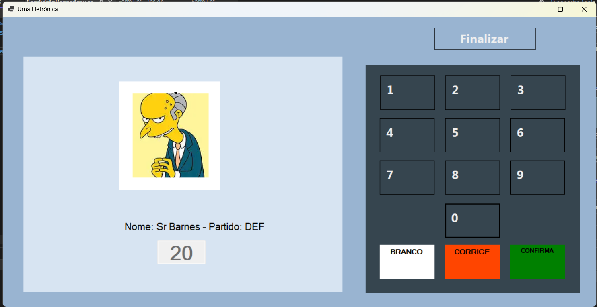

# 🗳️ Urna Eletrônica - Projeto em Windows Forms (C#)

Este projeto simula uma **urna eletrônica** utilizando **C# com Windows Forms**, com foco em arquitetura em camadas, gravação de votos com segurança (hash encadeado) e interface visual semelhante à urna real.

---

## 🔧 Tecnologias Utilizadas

- **Linguagem:** C#  
- **Interface:** Windows Forms (.NET 8 ou superior)  
- **Padrão de arquitetura:** Separação por camadas (MVC simplificado)  
- **Hash:** SHA256 (encadeamento estilo blockchain simples)  
- **Controle de versão:** Git + GitHub  

---

## 🧱 Estrutura do Projeto

```
UrnaEletronica/
├── Models/              # Representa os modelos de dados (ex: Candidato)
│   └── Candidato.cs
├── Repositories/        # Camada de acesso aos dados (dados em memória)
│   └── CandidatoRepository.cs
├── Services/            # Lógica de negócios (votação, gravação com hash)
│   └── VotacaoService.cs
├── Imagens/             # Fotos dos candidatos (ex: 13.jpg, 45.jpg)
├── votos.txt            # Arquivo onde os votos são gravados com hash
├── Form1.cs             # Lógica da interface gráfica (WinForms)
├── Form1.Designer.cs    # Layout da interface (gerado pelo Visual Studio)
├── Program.cs           # Entrada da aplicação
└── README.md
```

---

## 🧠 Funcionalidades

- Digite 2 números para visualizar o candidato (nome, partido e foto)



- Voto em **candidato**, **em branco** ou **nulo**
- Cada voto é salvo em `votos.txt` com um **hash encadeado**
- Interface inspirada em **urna real**, com botões coloridos e teclado numérico
- Estrutura em **camadas** (MVC simplificado)

---

## 🔐 Segurança - Hash Encadeado

Cada linha do `votos.txt` possui:
```
[DataHora]|[Número]|[Nome]|[Partido]|HASH:[SHA256(valor + hash anterior)]
```

Exemplo:
```
2025-04-10 16:34:49|20|Sr Barnes|DEF|HASH:AEO0zLYa71npa/AJlwdsk5s5eN2fZNEuIrINT+T30nM=
```

Isso garante integridade dos dados e rastreabilidade.

---

## ▶️ Como Executar o Projeto

1. **Clone o repositório**:
   ```bash
   git clone https://github.com/heliogald/UrnaEletronica.git
   cd UrnaEletronica
   ```

2. **Abra o projeto no Visual Studio**

3. **Verifique se o .NET 8.0+ está instalado**

4. **Rode o projeto (F5)**

---

## 🖼️ Como adicionar novos candidatos

1. Abra o arquivo `CandidatoRepository.cs`
2. Adicione um novo candidato à lista:
   ```csharp
   new Candidato { Numero = "10", Nome = "Homer Simpson", Partido = "ABC" },
   ```
3. Coloque a imagem `10.jpg` na pasta `Imagens/` na raiz do projeto.

---

## 📦 Git e versionamento

- O arquivo `votos.txt` **não é versionado** (ignorado via `.gitignore`)
- As imagens dos candidatos estão dentro da pasta `Imagens/`

---

## 🤝 Contribuição

Sinta-se à vontade para abrir issues, fazer forks ou pull requests.

---

## 📜 Licença

Este projeto é apenas educacional. Nenhuma ligação com sistemas eleitorais reais.

